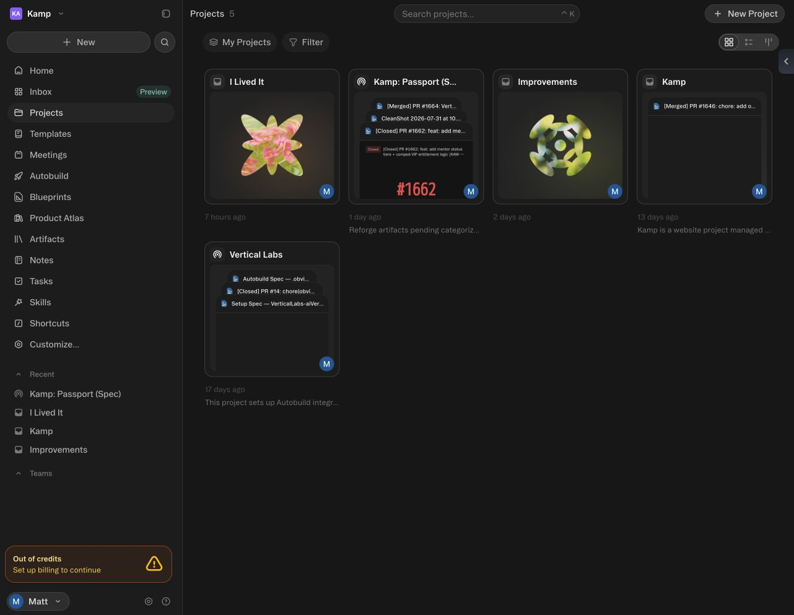
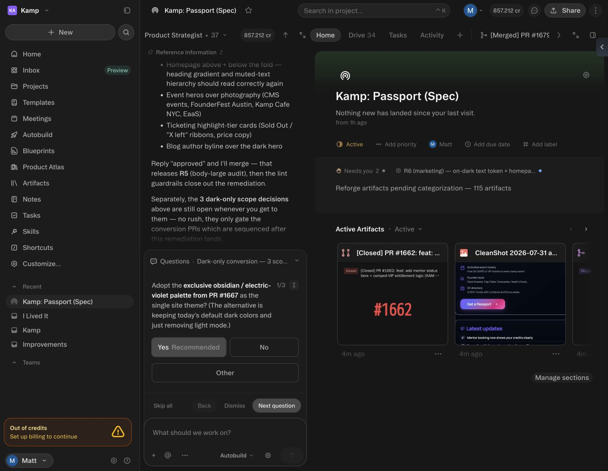
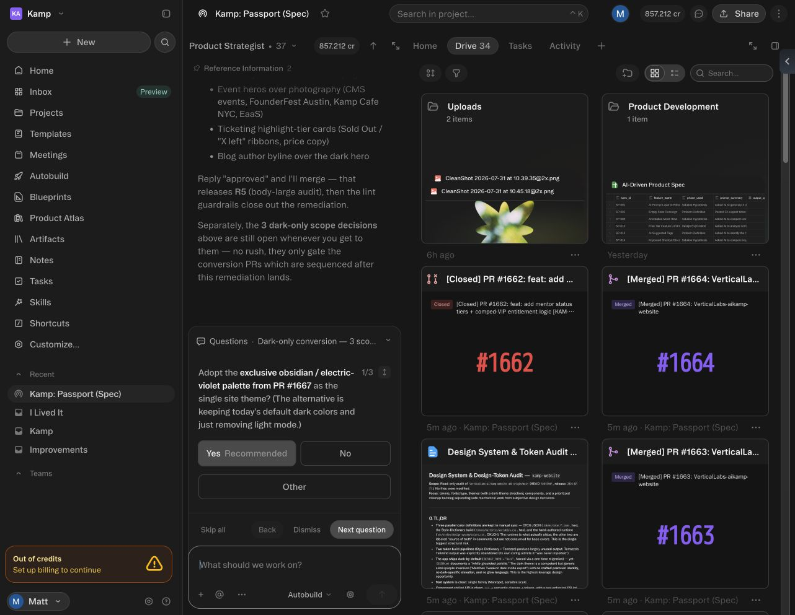
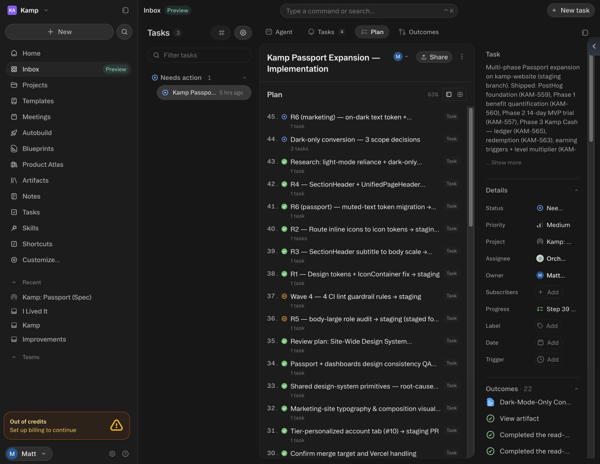
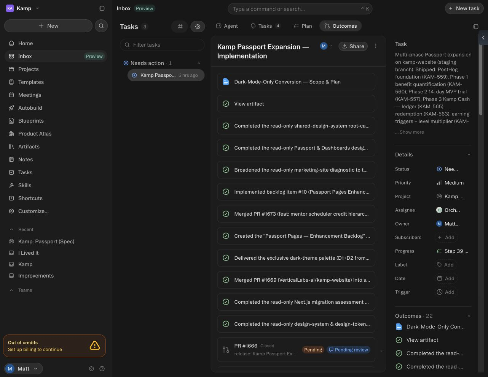
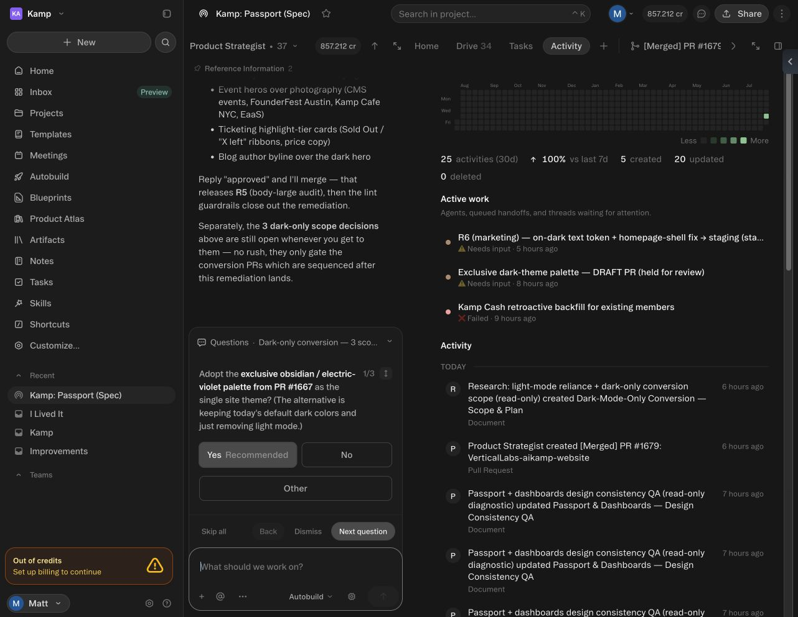
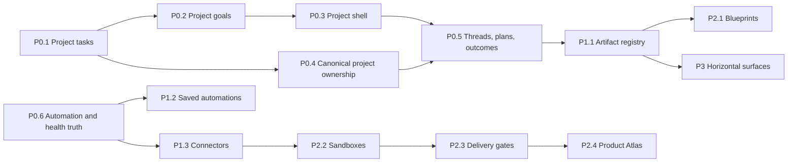

# Obvious-inspired operator workspace

Status: tracked in Linear; P0 implementation started 2026-07-31.

- Linear umbrella epic: [VER-504](https://linear.app/verticallabs/issue/VER-504/epic-obvious-inspired-operator-workspace)
- Linear project: [Eidolon — Paperclip Parity Roadmap](https://linear.app/verticallabs/project/eidolon-paperclip-parity-roadmap-18cfda96be64)
- Linear milestone: `M6 — Obvious-inspired operator workspace`
- Source workspace: [Kamp: Passport (Spec)](https://app.obvious.ai/p/kamp-passport-spec-hFa1Z0qX/home)
- Canonical repository: [VerticalLabs-ai/eidolon](https://github.com/VerticalLabs-ai/eidolon)

## Decision

Eidolon should not become a clone of Obvious. It should adopt Obvious's strongest operator model—project-centered context, persistent threads, plans, human gates, typed outcomes, artifacts, automations, and repository evidence—on top of Eidolon's existing agent-runtime control plane.

The implementation rule is:

1. Adapt an existing Eidolon primitive when it already owns the truth.
2. Enhance it when project scope, lifecycle, provenance, or UX is incomplete.
3. Write a new primitive only where no durable owner exists.

## Evidence pack

The screenshots below were captured from the logged-in Kamp workspace on 2026-07-31 and are also attached to VER-504.

### Workspace inventory

Five projects were visible: `I Lived It`, `Kamp: Passport (Spec)`, `Improvements`, `Kamp`, and `Vertical Labs`. The cards retain recent artifacts and a project description, and the workspace navigation exposes Projects, Templates, Meetings, Autobuild, Blueprints, Product Atlas, Artifacts, Notes, Tasks, Skills, and Shortcuts.

### Project Home and human gates

`Kamp: Passport (Spec)` has a project Home surface with active state, needs-attention count, 115 pending artifact categorizations, recent artifacts, persistent project conversation, and a human-owned decision card.

### Project Drive

The Drive contains folders, an AI-driven product-spec workbook, images, documents, and GitHub pull-request artifacts. The visible artifact count was 34.

### Persistent multi-phase plan

The main implementation task preserves a 45-step plan at 83% completion. It spans research, plan review, phased implementation, human decisions, release, audits, and design-system remediation.

### Typed outcomes

The task retained 22 outcomes across documents, completed audits, merged and closed pull requests, pending reviews, and delivery summaries instead of collapsing everything into chat text.

### Activity and operational truth

The project Activity view showed 25 activities over 30 days, 5 created, 20 updated, and 0 deleted. It also retained active, needs-input, and failed work states.

## Obvious platform map

| Capability | Reference | Relevant observed behavior |
| --- | --- | --- |
| Core model | [Key concepts](https://help.obvious.ai/getting-started/key-concepts) | Projects contain agent work, artifacts, and collaboration. |
| Dashboard | [Navigating the dashboard](https://help.obvious.ai/getting-started/navigating-the-dashboard) | Workspace navigation, search, inbox, and cross-project entry points. |
| Projects | [Projects overview](https://help.obvious.ai/projects/overview) | Durable context with Home, Drive, Tasks, Activity, threads, and collaborators. |
| Agents | [Agents overview](https://help.obvious.ai/agents/overview) | Specialized modes execute work inside project context. |
| Plans and gates | [Plans](https://help.obvious.ai/agents/plans) | Multi-step plans, review, permission gates, and per-step progress. |
| Skills | [Skills](https://help.obvious.ai/agents/skills) | Reusable capability/instruction packages. |
| My Day | [My Day](https://help.obvious.ai/agents/my-day) | Daily briefing and attention routing. |
| Files and Drive | [Files overview](https://help.obvious.ai/files/overview) | Typed files/artifacts with project placement and preview. |
| Workbooks | [Workbooks overview](https://help.obvious.ai/workbooks/overview) | Structured records, fields, formulas, forms, and import. |
| Views | [Views overview](https://help.obvious.ai/views/overview) | Multiple saved representations of shared data. |
| Dashboards | [Dashboards](https://help.obvious.ai/projects/dashboards) | Project-level reporting surfaces. |
| Automations | [Automations overview](https://help.obvious.ai/automations/overview) | Saved recurring workflows with triggers and outcomes. |
| Automation tasks | [Creating tasks](https://help.obvious.ai/automations/creating-tasks) | Automation steps create trackable project work. |
| Webhooks | [Triggering tasks from a webhook](https://help.obvious.ai/automations/triggering-tasks-from-webhook) | External events invoke the same task model. |
| Integrations | [Integrations overview](https://help.obvious.ai/integrations/overview) | Installed tools expose capabilities and lifecycle. |
| Meetings | [Meeting notes](https://help.obvious.ai/integrations/meeting-notes) | Meeting-derived notes and actions. |
| Sharing | [Sharing overview](https://help.obvious.ai/sharing/overview) | Collaborator access and shared project/artifact surfaces. |
| Roles | [Roles and permissions](https://help.obvious.ai/account/roles-permissions) | Workspace administration and access boundaries. |
| Folios | [Creating folios](https://help.obvious.ai/apps/creating-folios), [publishing folios](https://help.obvious.ai/apps/publishing-folios) | Bundled workspace artifacts become published experiences. |
| Autobuild | [Autobuild](https://help.obvious.ai/autobuild) | Repository work from scoped specs and agent tasks. |
| Repo context | [Repository context](https://help.obvious.ai/autobuild/give-autobuild-repository-context) | Repo-local instructions and codebase context shape execution. |
| Autobuild policy | [Workspace-level settings](https://help.obvious.ai/autobuild/workspace-level-settings), [code review](https://help.obvious.ai/autobuild/customizing-code-review) | Workspace sandboxes and review rules gate code work. |
| Developer surface | [Developer API](https://help.obvious.ai/developer-api), [SCIM](https://help.obvious.ai/developer-api/scim) | External automation and enterprise provisioning. |
| Marketplace | [Explore marketplace](https://help.obvious.ai/getting-started/explore-marketplace) | Discoverable reusable capabilities and templates. |

## Eidolon current substrate

Eidolon is ahead of a blank implementation. Its server already exposes projects, tasks, goals, messages, budgets, analytics, workflows, activity, secrets, chat, knowledge, files, integrations, memory, prompts, evaluations, MCP, webhooks, collaboration, export, approvals, inbox, runtime sessions, skills, routines, and environments.

The most important gaps are composition and truthfulness:

| Existing substrate | Current gap | Classification |
| --- | --- | --- |
| Projects + tasks | Project detail requests company-wide tasks; project-created tasks lose scope. | Adapt / Enhance |
| Hierarchical goals | Goals have no `projectId`; project goal count is hard-coded to zero. | Enhance |
| Task threads + interactions + approvals | No canonical project/user thread, plan, or outcome registry. | Enhance + targeted Scratch |
| Agent files + knowledge | No typed project artifact registry, folders, versions, or provenance. | Targeted Scratch over existing storage |
| Workflows + routines + schedules + webhooks | Overlapping automation definitions and run semantics. | Consolidate / Enhance |
| MCP + secrets + integrations | No complete install/auth/capability/health/revoke lifecycle; connection health is simulated. | Enhance |
| Agents + prompts + skills + adapters | Strong runtime model but weak operator-facing modes, shortcuts, and templates. | Adapt / Enhance |
| Budgets + usage + activity | Costs and governance are not consistently attributed to project/thread/run. | Enhance |
| Runtime environments + checkouts + workspace diffs | Strong basis for Autobuild, but no complete sandbox/repo contract and delivery gate model. | Enhance |
| GitNexus + repo/runtime evidence | No derived Product Atlas read model or UI. | Scratch read model |
| General workbook/docs/publishing/enterprise surfaces | No authoritative primitive today. | Scratch; defer |

## Prioritized roadmap and Linear map

All issues are children of a phase epic, belong to the existing Eidolon project, use the M6 milestone, and carry the `eidolon/obvious-parity` and phase labels.

### P0 — Make Projects real

Epic: [VER-507](https://linear.app/verticallabs/issue/VER-507/epic-p0-make-projects-real) — **In Progress / Urgent**

| Order | Issue | Classification | Delivery |
| --- | --- | --- | --- |
| 1 | [VER-509 — Scope project task boards and task creation](https://linear.app/verticallabs/issue/VER-509/p01-scope-project-task-boards-and-task-creation) | Adapt / Enhance | Active first slice |
| 2 | [VER-510 — Add project-scoped goals and truthful project counts](https://linear.app/verticallabs/issue/VER-510/p02-add-project-scoped-goals-and-truthful-project-counts) | Enhance | Schema + API + UI |
| 3 | [VER-511 — Compose Project Home, Work, Drive, and Activity](https://linear.app/verticallabs/issue/VER-511/p03-compose-project-home-work-drive-and-activity) | Adapt / Enhance | Compose existing data |
| 4 | [VER-512 — Make project ownership canonical across context and execution](https://linear.app/verticallabs/issue/VER-512/p04-make-project-ownership-canonical-across-context-and-execution) | Enhance | Cross-resource contract |
| 5 | [VER-514 — Build persistent project threads, plans, decisions, and outcomes](https://linear.app/verticallabs/issue/VER-514/p05-build-persistent-project-threads-plans-decisions-and-outcomes) | Enhance + targeted Scratch | Human-agent work surface |
| 6 | [VER-513 — Consolidate automation contracts and expose truthful integration health](https://linear.app/verticallabs/issue/VER-513/p06-consolidate-automation-contracts-and-expose-truthful-integration) | Consolidate / Enhance | Truthful platform state |

P0 exits when a project is an authoritative boundary: everything shown belongs to it, everything created inside retains it, and integrations never claim unsupported health.

### P1 — Operator layer

Epic: [VER-505](https://linear.app/verticallabs/issue/VER-505/epic-p1-operator-layer) — **Backlog / High**

| Order | Issue | Classification |
| --- | --- | --- |
| 1 | [VER-515 — Typed artifact registry and project Drive](https://linear.app/verticallabs/issue/VER-515) | Targeted Scratch + Adapt |
| 2 | [VER-516 — Saved automations with triggers, gates, and run history](https://linear.app/verticallabs/issue/VER-516) | Enhance |
| 3 | [VER-517 — Production connector lifecycle and capability discovery](https://linear.app/verticallabs/issue/VER-517) | Enhance |
| 4 | [VER-518 — Agent modes, custom agents, skills, shortcuts, and templates](https://linear.app/verticallabs/issue/VER-518) | Adapt / Enhance |
| 5 | [VER-519 — Usage, costs, access, governance, and audit](https://linear.app/verticallabs/issue/VER-519) | Enhance |
| 6 | [VER-520 — Unified search, inbox, and needs-attention views](https://linear.app/verticallabs/issue/VER-520) | Enhance |

P1 exits when reusable work, real connectors, artifacts, costs, permissions, and failures are operable inside project context.

### P2 — Autobuild and Product Atlas

Epic: [VER-506](https://linear.app/verticallabs/issue/VER-506/epic-p2-autobuild-and-product-atlas) — **Backlog / Medium**

| Order | Issue | Classification |
| --- | --- | --- |
| 1 | [VER-521 — Blueprint and product-spec pipeline](https://linear.app/verticallabs/issue/VER-521) | Enhance + targeted Scratch |
| 2 | [VER-522 — Isolated repository sandboxes and an `.eidolon` contract](https://linear.app/verticallabs/issue/VER-522) | Enhance |
| 3 | [VER-523 — PR, CI, review, approval, and release evidence gates](https://linear.app/verticallabs/issue/VER-523) | Enhance |
| 4 | [VER-524 — Product Atlas from authoritative code and runtime evidence](https://linear.app/verticallabs/issue/VER-524) | Scratch read model + UI |

P2 exits when an approved spec can become isolated, gated repository work and Atlas can explain the delivered system from fresh evidence.

### P3 — Horizontal workspace expansion

Epic: [VER-508](https://linear.app/verticallabs/issue/VER-508/epic-p3-horizontal-workspace-expansion) — **Backlog / Low**

| Order | Issue | Classification |
| --- | --- | --- |
| 1 | [VER-525 — Workbooks, forms, formulas, typed fields, and import](https://linear.app/verticallabs/issue/VER-525) | Scratch |
| 2 | [VER-526 — Kanban, calendar, timeline, gallery, checklist, and dashboards](https://linear.app/verticallabs/issue/VER-526) | Enhance + Scratch renderers |
| 3 | [VER-527 — Collaborative docs with comments, versions, and checkpoints](https://linear.app/verticallabs/issue/VER-527) | Scratch |
| 4 | [VER-528 — Folios/apps with access controls and custom domains](https://linear.app/verticallabs/issue/VER-528) | Scratch |
| 5 | [VER-529 — Meeting capture and My Day briefing](https://linear.app/verticallabs/issue/VER-529) | Enhance + targeted Scratch |
| 6 | [VER-530 — Marketplace, SCIM, enterprise policy, retention, and IP controls](https://linear.app/verticallabs/issue/VER-530) | Scratch / Enterprise |

P3 is intentionally conditional. A surface is built only after an observed workflow cannot be served by Projects + Drive + Threads + Automations + Atlas.

## Dependency spine

## Phase-zero implementation boundary

The first slice is VER-509. It deliberately uses the schema and server filter already present:

- Add `projectId` to the UI `TaskFilters` contract.
- Send it as the server's existing `project` query parameter.
- Read `projectId` from the route in `TaskBoard` and scope the query.
- Pass `projectId` into `CreateTaskModal` and persist it on creation.
- Leave the company-wide Tasks route unchanged.
- Add a focused regression check for scoped query and creation behavior.

This is the smallest root-cause fix that makes Project work truthful and establishes the convention for the rest of P0.
